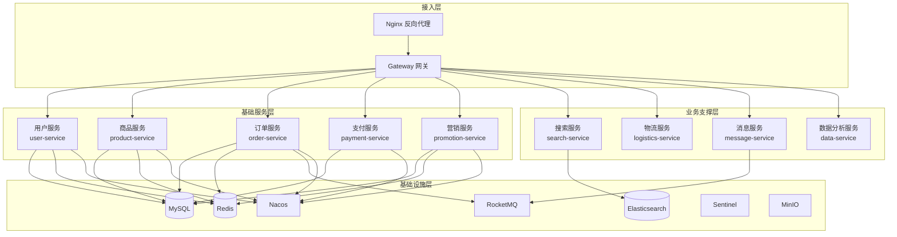
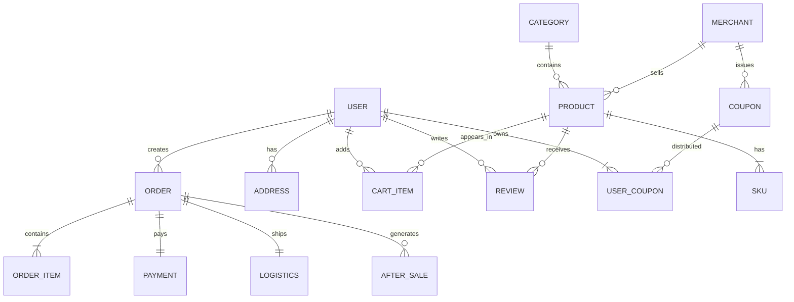
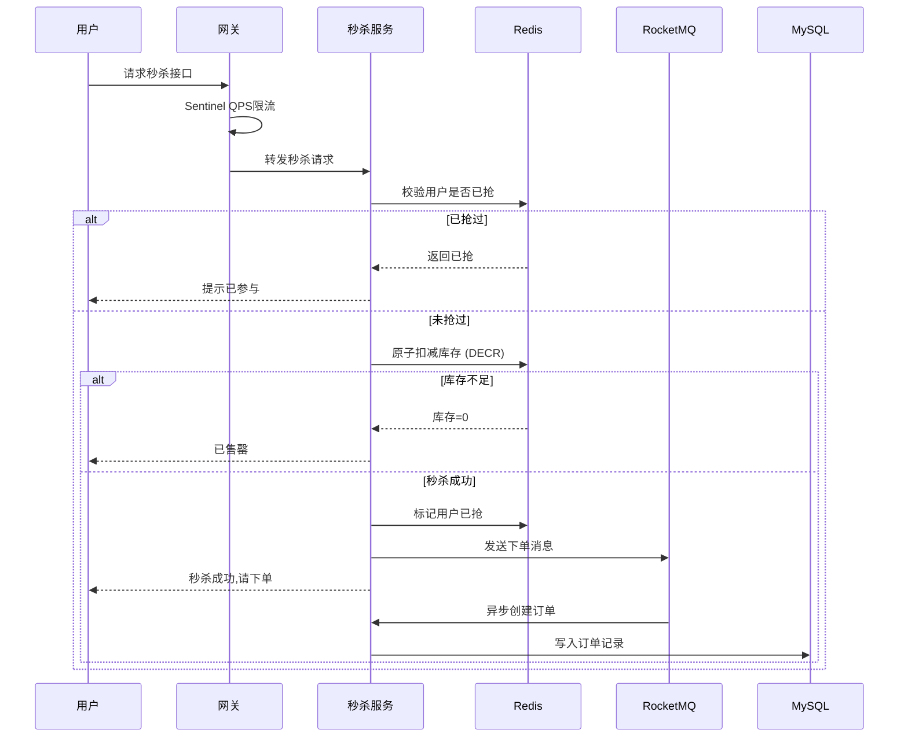

# 基于 Vue3 + Spring Cloud Alibaba 高并发电商系统 需求分析报告

**课程名称：** Web程序设计（J2EE）课程设计  
**专业班级：** 软工12301、12302、12303  
**指导教师：** 余华云  
**完成日期：** 2026年6月22日  

---

## 目录

1. [引言](#1-引言)
2. [系统概述](#2-系统概述)
3. [用户角色分析](#3-用户角色分析)
4. [功能性需求](#4-功能性需求)
5. [非功能性需求](#5-非功能性需求)
6. [技术架构方案](#6-技术架构方案)
7. [数据库设计概要](#7-数据库设计概要)
8. [高并发设计要点](#8-高并发设计要点)
9. [系统边界与约束](#9-系统边界与约束)
10. [验收标准](#10-验收标准)

---

## 1. 引言

### 1.1 编写目的

本文档旨在对"基于 Vue3 + Spring Cloud Alibaba 高并发电商系统"进行全面的需求分析，明确系统的功能需求与非功能需求，为后续系统设计、开发、测试及验收提供依据。

### 1.2 项目背景

随着电子商务的快速发展，电商平台需要承载日益增长的用户访问量和交易量。传统的单体架构难以满足高并发场景下的性能要求。本项目采用前后端分离架构，前端使用 Vue3 框架，后端基于 Spring Cloud Alibaba 微服务架构，旨在构建一个具备高并发处理能力的全功能电商平台。

### 1.3 适用范围

本文档适用于本课程设计项目的全体参与人员，包括指导教师、开发人员及评审人员。

---

## 2. 系统概述

### 2.1 系统目标

构建一个功能完备、性能优异的电商平台，支持用户前台购物、商家后台管理、平台运营管理三大业务场景，并具备应对高并发访问（如秒杀、大促活动）的技术能力。

### 2.2 系统定位

本系统为 B2B2C 模式的多商户电商平台，平台方负责运营管理，商家入驻后发布商品，用户通过前端进行浏览和购买。

### 2.3 核心业务闭环


---

## 3. 用户角色分析

| 角色 | 描述 | 核心诉求 |
|------|------|---------|
| **普通用户（C端）** | 平台消费者 | 浏览商品、下单购买、查看订单、参与活动、管理个人账户 |
| **商家（B端）** | 入驻商户 | 管理商品、处理订单、查看数据报表、参与营销活动 |
| **平台管理员** | 平台运营方 | 审核商家与商品、管理活动、权限分配、数据分析、系统配置 |
| **系统管理员** | 技术运维 | 系统监控、服务治理、日志管理、安全保障 |

### 3.1 角色权限矩阵

| 功能模块 | 普通用户 | 商家 | 平台管理员 | 系统管理员 |
|---------|:-------:|:---:|:--------:|:--------:|
| 商品浏览/搜索 | ✓ | ✓ | ✓ | - |
| 下单/支付 | ✓ | - | - | - |
| 商品管理 | - | ✓ | ✓ | - |
| 订单管理 | ✓ (自己的) | ✓ (店铺) | ✓ (全部) | - |
| 营销活动 | - | ✓ | ✓ | - |
| 数据分析 | - | ✓ (店铺) | ✓ (大盘) | ✓ |
| 权限管理 | - | - | ✓ | - |
| 系统配置 | - | - | ✓ | ✓ |
| 服务治理 | - | - | - | ✓ |

---

## 4. 功能性需求

### 4.1 用户前台（C端）

#### 4.1.1 基础导购模块

| 编号 | 功能 | 详细描述 | 优先级 |
|------|------|---------|:-----:|
| FR-UC-01 | 首页推荐 | 轮播 Banner、商品分类图标导航、猜你喜欢（基于浏览记录）、热销排行、新品推荐 | 高 |
| FR-UC-02 | 分类导航 | 多级商品类目树，支持通过类目筛选商品，面包屑导航 | 高 |
| FR-UC-03 | 全文搜索 | 关键词搜索、搜索联想/自动补全、搜索历史记录、热搜词展示 | 高 |
| FR-UC-04 | 高级搜索 | 按价格区间、品牌、规格、评分等多条件组合筛选排序（综合/销量/价格/评价/新品） | 中 |
| FR-UC-05 | 商品详情 | 商品主图（支持放大镜）、规格选择（SKU联动）、价格（原价/活动价）、库存提示、商品描述（富文本）、规格参数表 | 高 |
| FR-UC-06 | 评价问答 | 商品评价列表（含好评/中评/差评筛选、晒图）、评分统计、购买咨询（Q&A）、评价点赞 | 中 |
| FR-UC-07 | 商品收藏 | 收藏/取消收藏商品，收藏夹管理 | 中 |
| FR-UC-08 | 购物车 | 添加商品到购物车、修改数量/规格、勾选结算、删除商品、失效商品提示、购物车商品推荐 | 高 |

#### 4.1.2 交易流程模块

| 编号 | 功能 | 详细描述 | 优先级 |
|------|------|---------|:-----:|
| FR-UC-09 | 订单确认 | 选择收货地址、确认商品信息、选择优惠券/红包、计算总价（含满减/优惠）、选择支付方式 | 高 |
| FR-UC-10 | 订单提交 | 生成订单、库存预占、优惠券核销、防止重复提交 | 高 |
| FR-UC-11 | 地址管理 | 新增/编辑/删除收货地址，设置默认地址，省市区三级联动 | 高 |
| FR-UC-12 | 优惠券 | 领取优惠券、查看可用优惠券、优惠券使用条件校验 | 高 |
| FR-UC-13 | 红包 | 积分兑换红包、平台发放红包、红包有效期管理 | 中 |
| FR-UC-14 | 满减活动 | 参与满减活动、跨店满减计算、满减叠加规则 | 中 |
| FR-UC-15 | 计算规则 | 支持优惠叠加计算（满减+优惠券+红包），自动选择最优优惠组合 | 中 |

#### 4.1.3 支付履约模块

| 编号 | 功能 | 详细描述 | 优先级 |
|------|------|---------|:-----:|
| FR-UC-16 | 多渠道支付 | 支付宝支付、微信支付、银行卡支付（模拟） | 高 |
| FR-UC-17 | 支付回调 | 异步支付结果通知、幂等处理、订单状态更新 | 高 |
| FR-UC-18 | 订单状态 | 待付款→已付款/待发货→已发货→已收货→已完成（及取消、退款等逆向状态） | 高 |
| FR-UC-19 | 物流跟踪 | 查看物流信息（对接第三方物流API模拟）、物流节点更新 | 中 |
| FR-UC-20 | 退款/退货 | 申请退款、申请退货退款、商家审核、填写退货物流、退款到账 | 高 |
| FR-UC-21 | 换货 | 申请换货、商家审核、换货发货 | 中 |
| FR-UC-22 | 订单评价 | 商品评分（1-5星）、文字评价、晒图、追评 | 中 |

#### 4.1.4 会员体系模块

| 编号 | 功能 | 详细描述 | 优先级 |
|------|------|---------|:-----:|
| FR-UC-23 | 注册登录 | 手机号注册/登录、密码登录、短信验证码（模拟）、JWT Token 认证 | 高 |
| FR-UC-24 | 第三方登录 | 微信登录、QQ登录（模拟OAuth2.0） | 低 |
| FR-UC-25 | 账号安全 | 修改密码、绑定手机、安全设置 | 中 |
| FR-UC-26 | 积分体系 | 购物积分、签到积分、积分兑换、积分明细 | 中 |
| FR-UC-27 | 会员等级 | 普通/银卡/金卡/钻石等级，基于消费累计升降级、差异化权益 | 中 |
| FR-UC-28 | 个人中心 | 个人信息管理、头像上传、订单列表、收藏夹 | 高 |
| FR-UC-29 | 消息推送 | 订单状态通知、促销活动推送、系统公告（WebSocket实时推送+站内信） | 中 |

---

### 4.2 商家后台（B端）

#### 4.2.1 商品管理模块

| 编号 | 功能 | 详细描述 | 优先级 |
|------|------|---------|:-----:|
| FR-BE-01 | 商品发布 | 选择类目、填写商品信息（标题/描述/品牌）、上传图片/视频、设置规格（SKU）、设置价格 | 高 |
| FR-BE-02 | SKU管理 | 多规格组合（如颜色+尺寸）、SKU独立价格/库存/图片，SKU批量编辑 | 高 |
| FR-BE-03 | 库存管理 | 实时库存更新、库存预警阈值设置、库存盘点、库存日志 | 高 |
| FR-BE-04 | 商品上下架 | 上架/下架操作、批量操作、定时上架 | 高 |
| FR-BE-05 | 图文编辑 | 富文本编辑器编辑商品详情、模板选择 | 中 |
| FR-BE-06 | 价格管理 | 日常价格设置、活动价格/划线价、批量调价 | 高 |
| FR-BE-07 | 商品审核 | 提交审核→平台审核→审核通过/驳回（修改后重提） | 高 |

#### 4.2.2 订单处理模块

| 编号 | 功能 | 详细描述 | 优先级 |
|------|------|---------|:-----:|
| FR-BE-08 | 订单列表 | 多状态筛选（待发货/已发货/已完成/售后中）、订单搜索、订单详情 | 高 |
| FR-BE-09 | 发货管理 | 录入物流信息、批量发货（Excel导入）、电子面单打印 | 高 |
| FR-BE-10 | 订单审核 | 异常订单审核（地址异常/库存不足/风控拦截）、订单手动改单 | 中 |
| FR-BE-11 | 对账管理 | 销售对账单、平台佣金计算、结算明细 | 中 |
| FR-BE-12 | 售后处理 | 审核退款/退货/换货申请，同意/拒绝，退货收货确认，退款操作 | 高 |

#### 4.2.3 营销工具模块

| 编号 | 功能 | 详细描述 | 优先级 |
|------|------|---------|:-----:|
| FR-BE-13 | 限时活动 | 店铺满减/折扣活动、活动时间设置、适用范围（全店/部分商品） | 高 |
| FR-BE-14 | 优惠券 | 店铺优惠券（满减券/折扣券）、发行数量/领取限制、定向发放 | 高 |
| FR-BE-15 | 拼团 | 设置拼团商品、拼团价、成团人数、有效期 | 中 |
| FR-BE-16 | 秒杀 | 秒杀商品设置、秒杀价格/库存、秒杀时段安排 | 高 |
| FR-BE-17 | 预售 | 预售商品设置、定金/尾款、预售发货时间 | 中 |
| FR-BE-18 | 组合套餐 | 搭配套餐设置、套餐价格优惠、关联销售 | 低 |

#### 4.2.4 数据看板模块

| 编号 | 功能 | 详细描述 | 优先级 |
|------|------|---------|:-----:|
| FR-BE-19 | 销售数据 | 销售额/订单量趋势（今日/本周/本月）、同比环比 | 高 |
| FR-BE-20 | 流量分析 | 访客数（UV/PV）、商品浏览量、转化率、跳失率 | 中 |
| FR-BE-21 | 营收统计 | 实收金额、退款金额、平台佣金、净收入 | 中 |
| FR-BE-22 | 库存报表 | 库存周转率、滞销商品、库存预警商品 | 中 |
| FR-BE-23 | 商品排行 | 热销商品TOP、滞销商品、复购率统计 | 低 |

---

### 4.3 运营总后台（平台方）

#### 4.3.1 活动运营模块

| 编号 | 功能 | 详细描述 | 优先级 |
|------|------|---------|:-----:|
| FR-PA-01 | 活动配置 | 创建全平台活动（双11/618/年货节）、活动规则设置、活动首页装修 | 高 |
| FR-PA-02 | 会场搭建 | 活动会场页面配置、商品分区、组件化搭建 | 中 |
| FR-PA-03 | 活动审核 | 审核商家报名、审核活动方案、违规处理 | 中 |
| FR-PA-04 | 排期管理 | 活动排期日历、冲突检测、活动状态自动流转 | 中 |

#### 4.3.2 权限与风控模块

| 编号 | 功能 | 详细描述 | 优先级 |
|------|------|---------|:-----:|
| FR-PA-05 | 角色管理 | RBAC模型、角色（超级管理员/运营/客服/审核员）、权限粒度到按钮级 | 高 |
| FR-PA-06 | 用户管理 | 后台用户创建/禁用、角色分配、登录日志 | 高 |
| FR-PA-07 | 内容审核 | 商品审核（违规/敏感词过滤）、评价审核、商家资质审核 | 高 |
| FR-PA-08 | 商家管理 | 商家入驻审核、商家等级管理、保证金管理、违规处罚/封禁 | 高 |
| FR-PA-09 | 风控规则 | 刷单检测、恶意评价识别、异常交易监控、IP黑名单 | 中 |

#### 4.3.3 配置中心模块

| 编号 | 功能 | 详细描述 | 优先级 |
|------|------|---------|:-----:|
| FR-PA-10 | 系统参数 | 全局参数配置（时效/限额/开关）、动态刷新 | 中 |
| FR-PA-11 | 字典管理 | 数据字典（类目/品牌/属性/标签）、字典维护 | 中 |
| FR-PA-12 | 弹窗管理 | APP弹窗公告、启动页管理 | 低 |
| FR-PA-13 | 公告管理 | 系统公告、消息推送模板 | 中 |
| FR-PA-14 | 渠道配置 | 渠道来源追踪、渠道统计分析 | 低 |

#### 4.3.4 数据分析模块

| 编号 | 功能 | 详细描述 | 优先级 |
|------|------|---------|:-----:|
| FR-PA-15 | 大盘数据 | GMV/订单量/用户数实时大屏（ECharts可视化） | 高 |
| FR-PA-16 | 用户画像 | 用户属性标签、行为标签、偏好标签、用户分层 | 中 |
| FR-PA-17 | 流量分析 | 流量来源、页面热力、用户路径分析、漏斗转化 | 中 |
| FR-PA-18 | 营销效果 | 活动ROI、优惠券核销率、活动对比分析 | 低 |

---

### 4.4 高并发专属模块

| 编号 | 功能 | 详细描述 | 优先级 |
|------|------|---------|:-----:|
| FR-HC-01 | 秒杀 | 秒杀商品展示、倒计时、防超卖（Redis原子操作）、限流、验证码防刷、秒杀地址隐藏 | 高 |
| FR-HC-02 | 缓存策略 | 多级缓存（浏览器→CDN→Nginx本地→Redis→DB）、缓存预热、缓存更新策略、缓存穿透/击穿/雪崩防护 | 高 |
| FR-HC-03 | 限流降级 | Sentinel 接口限流（QPS/线程数）、服务熔断降级（默认/自定义兜底）、热点参数限流 | 高 |
| FR-HC-04 | 消息队列 | 异步下单削峰填谷、订单超时取消、库存扣减异步化、日志采集 | 高 |
| FR-HC-05 | 分布式锁 | 基于 Redisson 的分布式锁，防止库存超卖/重复下单 | 高 |
| FR-HC-06 | 读写分离 | 主库写/从库读、ShardingSphere-JDBC 分库分表（订单表） | 中 |
| FR-HC-07 | CDN | 静态资源CDN加速（图片/CSS/JS）、OSS对象存储 | 中 |

---

## 5. 非功能性需求

### 5.1 性能需求

| 指标 | 目标值 | 
|------|--------|
| 首页加载时间 | P99 < 3秒 |
| 商品详情页加载 | P99 < 2秒 |
| 搜索响应时间 | P99 < 500ms |
| 下单接口响应 | P99 < 1秒 |
| 秒杀接口QPS | 单节点 ≥ 5000 QPS |
| 系统整体QPS | 集群 ≥ 10000 QPS |
| 并发用户数 | 支持 10000 并发在线 |

### 5.2 可用性需求

| 指标 | 目标值 |
|------|--------|
| 系统可用性 | ≥ 99.9%（全年宕机 < 8.76小时） |
| 服务故障恢复 | 自动切换，< 30秒 |
| 数据备份 | 每日全量备份 + 增量日志 |
| 灰度发布 | 支持按流量比例灰度 |

### 5.3 安全性需求

| 编号 | 需求描述 |
|------|---------|
| NR-S-01 | 用户密码 BCrypt 加密存储，不得明文传输 |
| NR-S-02 | 接口采用 JWT + OAuth2.0 认证，支持 Token 刷新 |
| NR-S-03 | SQL注入防护（参数化查询/MyBatis Plus） |
| NR-S-04 | XSS/CSRF 攻击防护 |
| NR-S-05 | API 接口签名校验，防篡改/重放攻击 |
| NR-S-06 | 敏感数据脱敏（手机号/身份证号等） |
| NR-S-07 | 接口访问频率限制（防刷/防爬） |
| NR-S-08 | 操作日志审计（谁/什么时间/做了什么/IP） |

### 5.4 可扩展性需求

- 微服务架构，各服务独立部署、独立扩展
- 支持水平扩展，通过增加节点提升系统容量
- 数据库分库分表，支持数据量增长
- 插件化优惠券/营销规则引擎，便于新增活动类型

### 5.5 可维护性需求

- 统一日志格式（ELK日志收集）
- 服务健康检查与监控告警（Spring Boot Actuator + Prometheus + Grafana）
- 分布式链路追踪（SkyWalking）
- 统一的异常处理与返回格式
- API 文档自动生成（Knife4j / Swagger3）

---

## 6. 技术架构方案

### 6.1 技术选型

| 层级 | 技术 | 版本 | 说明 |
|------|------|------|------|
| **前端框架** | Vue3 + TypeScript | 3.4+ | 组合式API |
| **前端构建** | Vite | 5.x | 快速开发构建 |
| **UI组件库** | Element Plus | 2.x | 管理后台UI |
| **移动端UI** | Vant | 4.x | C端移动端适配 |
| **状态管理** | Pinia | 2.x | Vue3状态管理 |
| **路由** | Vue Router | 4.x | 前端路由 |
| **HTTP客户端** | Axios | 1.x | 请求封装 |
| **图表** | ECharts | 5.x | 数据可视化 |
| **后端框架** | Spring Cloud Alibaba | 2023.x | 微服务全家桶 |
| **Spring Boot** | Spring Boot | 3.x | 基础框架 |
| **注册/配置中心** | Nacos | 2.x | 服务发现与配置管理 |
| **网关** | Spring Cloud Gateway | 4.x | API网关 |
| **服务调用** | Dubbo / OpenFeign | - | RPC/HTTP 远程调用 |
| **熔断限流** | Sentinel | 1.8.x | 流量治理 |
| **分布式事务** | Seata | 1.8.x | AT模式分布式事务 |
| **消息队列** | RocketMQ | 5.x | 削峰填谷/异步解耦 |
| **缓存** | Redis + Redisson | 7.x | 分布式缓存/锁 |
| **数据库** | MySQL | 8.0+ | 主数据库 |
| **ORM** | MyBatis Plus | 3.5+ | 数据访问 |
| **搜索引擎** | Elasticsearch | 8.x | 全文搜索 |
| **对象存储** | MinIO | - | 图片/文件存储 |
| **分库分表** | ShardingSphere-JDBC | 5.x | 数据分片 |
| **链路追踪** | SkyWalking | 9.x | APM |
| **容器化** | Docker + Docker Compose | - | 本地开发环境 |

### 6.2 微服务划分



### 6.3 前端项目结构

```
ecommerce-frontend/
├── src/
│   ├── api/              # API 接口层
│   ├── assets/           # 静态资源
│   ├── components/       # 通用组件
│   ├── composables/      # 组合式函数
│   ├── layouts/          # 布局组件
│   │   ├── user/         # C端布局
│   │   ├── merchant/     # 商家端布局
│   │   └── admin/        # 平台端布局
│   ├── router/           # 路由配置
│   ├── stores/           # Pinia 状态
│   ├── utils/            # 工具函数
│   └── views/            # 页面视图
│       ├── user/         # C端页面
│       ├── merchant/     # 商家端页面
│       └── admin/        # 平台端页面
├── public/
└── package.json
```

### 6.4 后端项目结构

```
ecommerce-platform/
├── ecommerce-gateway/          # Spring Cloud Gateway 网关
├── ecommerce-common/           # 公共模块
│   ├── common-core/            # 核心工具
│   ├── common-security/        # 安全模块
│   └── common-web/             # Web配置
├── ecommerce-service/          # 微服务
│   ├── user-service/           # 用户服务
│   ├── product-service/        # 商品服务
│   ├── order-service/          # 订单服务
│   ├── payment-service/        # 支付服务
│   ├── promotion-service/      # 营销服务
│   ├── search-service/         # 搜索服务
│   ├── logistics-service/      # 物流服务
│   ├── message-service/        # 消息服务
│   └── data-service/           # 数据分析服务
└── docker-compose.yml
```

---

## 7. 数据库设计概要

### 7.1 核心实体关系



### 7.2 核心数据表

| 表名 | 所属服务 | 说明 | 分片策略 |
|------|---------|------|---------|
| `t_user` | user-service | 用户表 | - |
| `t_user_address` | user-service | 收货地址表 | - |
| `t_merchant` | user-service | 商家表 | - |
| `t_category` | product-service | 商品类目表 | - |
| `t_product` | product-service | 商品表(SPU) | - |
| `t_sku` | product-service | SKU表 | - |
| `t_sku_stock` | product-service | 库存表 | - |
| `t_order` | order-service | 订单主表 | 按用户ID分片 |
| `t_order_item` | order-service | 订单明细表 | 按订单ID分片 |
| `t_payment` | payment-service | 支付记录表 | - |
| `t_cart` | product-service | 购物车表(Redis) | - |
| `t_coupon` | promotion-service | 优惠券模板表 | - |
| `t_user_coupon` | promotion-service | 用户优惠券表 | - |
| `t_seckill` | promotion-service | 秒杀活动表 | - |

---

## 8. 高并发设计要点

### 8.1 秒杀场景方案

秒杀场景是高并发系统的典型挑战，核心问题是**防止超卖**和**应对极高瞬时流量**。

#### 8.1.1 秒杀流程



#### 8.1.2 防超卖策略

| 策略 | 说明 |
|------|------|
| Redis 原子扣减 | 使用 `DECR` 命令 + Lua 脚本，保证原子性 |
| 分布式锁 | Redisson 公平锁，避免重复下单 |
| 数据库乐观锁 | `UPDATE ... WHERE stock >= ?` + 版本号 |
| 限流削峰 | 网关层 Sentinel 限流 + RocketMQ 队列缓冲 |

#### 8.1.3 缓存策略

| 场景 | 策略 | 过期时间 |
|------|------|---------|
| 商品基本信息 | 写时更新缓存（Cache Aside） | 1小时 |
| 商品详情页 | 多级缓存（Nginx → Redis） | 10分钟 |
| 首页数据 | 定时预热 + 随机过期 | 30分钟 ± 5分钟 |
| 用户Session | Redis集中存储 | 30分钟(Token刷新) |
| 秒杀商品 | 活动前预热到Redis | 至活动结束 |

#### 8.1.4 缓存问题防护

| 问题 | 解决方案 |
|------|---------|
| 缓存穿透 | 布隆过滤器 + 空值缓存 |
| 缓存击穿 | 热点Key永不过期 + 互斥锁 |
| 缓存雪崩 | 过期时间随机化 + 多级缓存 + 限流降级 |

### 8.2 读写分离与分库分表

- **读写分离**：主库处理写操作，从库处理读操作（商品查询、订单列表等）
- **订单表分片**：按 `user_id % N` 分片，避免单表数据量过大
- **历史数据归档**：已完成订单定期归档到历史库

### 8.3 异步化策略

| 场景 | 异步方式 |
|------|---------|
| 下单后库存扣减 | RocketMQ → order-service 消费 |
| 支付回调通知 | RocketMQ → 订单状态更新 |
| 订单超时取消 | RocketMQ 延迟消息（15分钟） |
| 日志采集 | RocketMQ → ELK |
| 短信/推送 | RocketMQ → message-service |

---

## 9. 系统边界与约束

### 9.1 系统范围

**包含：**
- 完整的用户前台（PC + 移动端适配）
- 商家后台管理系统
- 平台运营管理后台
- 高并发核心组件（秒杀、缓存、限流）

**不包含（本期）：**
- 真正的第三方支付对接（使用模拟支付）
- 真正的短信/物流API对接（使用模拟数据）
- 移动端原生APP（APP可后续通过 uniapp 扩展）
- AI推荐系统（仅实现规则推荐）
- 财务系统对接（仅内部对账）

### 9.2 技术约束

- 后端必须基于 Spring Cloud Alibaba 微服务架构
- 前端必须使用 Vue3 框架
- 数据库使用 MySQL，缓存使用 Redis
- 开发环境使用 Docker Compose 编排
- JDK 版本 ≥ 17

### 9.3 项目约束

- 开发周期：10天
- 团队规模：按软工班级分组（约3-5人/组）
- 需提交：源代码 + 可运行系统 + 课程实践报告

---

## 10. 验收标准

### 10.1 功能验收（占比 60%）

| 验收项 | 标准 | 
|--------|------|
| 用户前台 | 完整的注册/登录、商品浏览/搜索、购物车/下单/支付、订单管理、售后流程 |
| 商家后台 | 商品CRUD及审核、订单处理及发货、营销活动配置、数据看板 |
| 平台后台 | RBAC权限管理、商品/内容审核、活动管理、配置中心 |
| 高并发 | 秒杀流程（防超卖）、Redis缓存、Sentinel限流、RocketMQ异步 |

### 10.2 性能验收（占比 20%）

| 验收项 | 标准 |
|--------|------|
| 基本CRUD接口 | 响应时间 < 500ms |
| 搜索接口 | 响应时间 < 1秒 |
| 秒杀接口 | 单机 ≥ 1000 QPS（需压测报告） |
| 缓存命中率 | ≥ 80% |

### 10.3 代码质量验收（占比 10%）

- 代码规范：统一的命名与注释规范
- API 文档：完整的 Swagger/Knife4j 文档
- 日志规范：关键操作有日志记录
- 异常处理：全局异常捕获与统一返回格式

### 10.4 文档验收（占比 10%）

- 需求分析报告
- 系统设计报告（含架构图、数据库E-R图）
- 接口文档
- 部署说明
- 用户操作手册

---

## 11. 风险分析

| 风险 | 影响 | 概率 | 应对措施 |
|------|------|:--:|------|
| 开发时间不足 | 功能无法全部完成 | 高 | 优先实现核心流程，非核心功能降级为"基础实现" |
| 技术难度超预期 | 部分功能阻塞 | 中 | 提前学习关键技术（Redis/Seata/Sentinel），准备简化备选方案 |
| 团队协作冲突 | 代码合并困难 | 中 | 统一代码规范，使用 Git 分支管理，每日集成 |
| 环境搭建问题 | 开发进度延迟 | 低 | 提供Docker Compose一键部署，统一开发环境 |

---

**编制人：** \_\_\_\_\_\_\_\_\_\_\_\_  
**日期：** 2026年6月22日  
**审核人：** 余华云  
**审核日期：** \_\_\_\_\_\_\_\_\_\_\_\_
